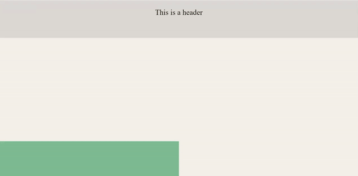

# Typeform homepage animations clone    

  

* [Content (en-US)](#secao-en_us)
* [Conteúdo (pt-BR)](#secao-pt_br)

## About the project 

This is a simple clone of Typeform site homepage animations using the Framer Motion lib and Styled Components.

Check this site working now: http://bit.ly/typeform-clone

## Content
  * [How to run the project](#installation)

## How to run the project 
To run the project, you'll need to have Node and NPM or Yarn installed to setup all the dependencies.

Install all dependencies using the `yarn` command, and run `yarn start` to open the project page on `localhost:3000`.

---

## Sobre o projeto 

Este é um clone simples das animações da homepage do site do Typeform usando a biblioteca Framer Motion e Styled Components.

Veja esse site funcionando agora: http://bit.ly/typeform-clone

## Conteúdos
  * [Como executar o projeto](#instalacao)

## Como executar o projeto 
Para executar o projeto, você irá precisar ter o Node e o NPM ou Yarn instalados para baixar as dependências.

Instale todas as dependencias utilizando o comando `yarn`, e rode o comando `yarn start` para abrir o a página do projeto em `localhost:3000`

---
###### Developed by [Gean Lucas](https://www.linkedin.com/in/geanlucaas/) :rocket:.
